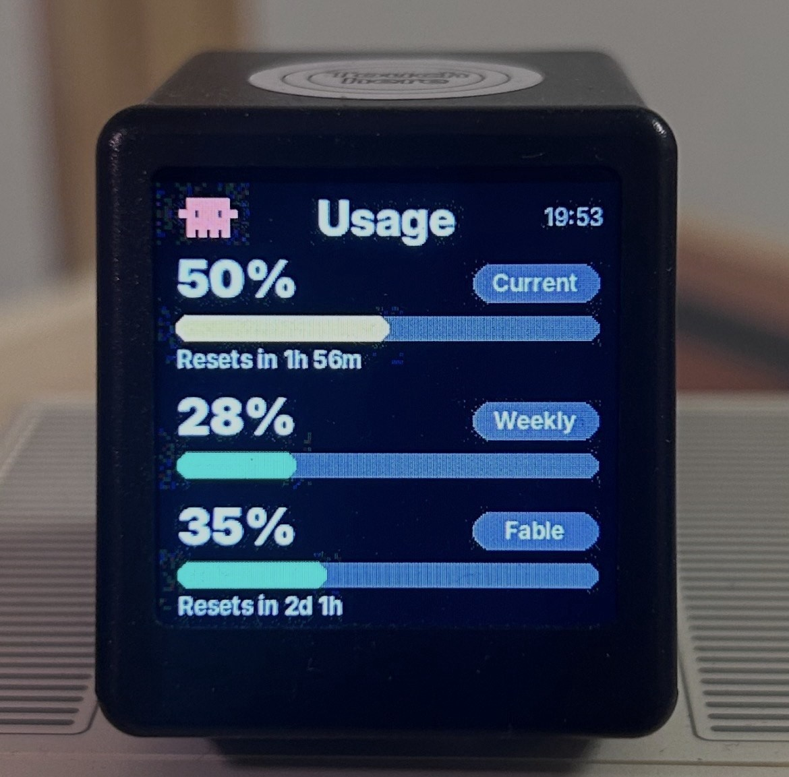

# geekclock-claude

Push your [Claude.ai](https://claude.ai) usage limits to a
**GeekMagic SmallTV** — a tiny WiFi-connected display the size of a
sugar cube — so you can see your 5-hour and weekly quota at a glance
without opening the Claude app.



## The device

This script targets the **GeekMagic SmallTV** family — small ESP32-based
WiFi clocks with a 1.5" 240×240 IPS display, originally designed to show
weather, GIFs and crypto prices. They expose a simple HTTP API for
uploading custom images.

**Where to buy:**
- [AliExpress — GeekMagic SmallTV / SmallTV-Ultra](https://aliexpress.com/item/1005005132140010.html)
- Official site: [geekmagic.com](https://geekmagic.com)
- Search "GeekMagic SmallTV" on eBay / Amazon for local sellers

**Specs:**
- 1.5" 240×240 IPS TFT display
- WiFi 2.4 GHz
- USB-C power (5V, 1A)
- ~35 × 39 × 45 mm

This project should work on any SmallTV variant (Lite, Pro, Ultra) and
likely on other GeekMagic models with the same `/doUpload` endpoint.

## What it does

Every time it runs (typically once a minute via cron):

1. Calls `claude.ai/api/organizations/{org}/usage` — the same endpoint
   the Claude.ai website uses on the **Settings → Usage** page
2. Renders a 240×240 PNG with two progress bars:
   - **Current** — 5-hour rolling window
   - **Weekly** — 7-day rolling window
3. Uploads the image to your clock over HTTP

Bars are colour-coded:
- 🟢 **green** under 50%
- 🟡 **yellow** 50–80%
- 🔴 **red** above 80%

Both blocks also show time until reset ("Resets in 4h 37m", "Resets in 3d").

## Why this approach?

The official `api.anthropic.com/api/oauth/usage` endpoint exists but
has a much stricter rate limit and returns `HTTP 429` if you (or any
of your Claude.ai / Claude Code clients) hit it frequently.

The website endpoint is what real apps like
[ClaudeMeter](https://github.com/eddmann/ClaudeMeter) use, and it
tolerates frequent polling.

To bypass Cloudflare's bot challenge (which blocks plain `curl`/`requests`
from server IPs) we use [`curl_cffi`](https://github.com/lexiforest/curl_cffi),
which impersonates a real Chrome TLS fingerprint.

## Requirements

- Python 3.9+
- A GeekMagic SmallTV (or compatible) on your local network
- A Claude.ai account with an active session

## Install

```bash
git clone https://github.com/egerkuzma/geekclock-claude.git
cd geekclock-claude
pip install -r requirements.txt
```

For nicer typography (optional but recommended on Linux):

```bash
sudo apt install fonts-inter
```

## Configure

You need three things:

1. **`sessionKey`** — your Claude.ai session cookie
2. **GeekMagic device IP** — find it in your router's DHCP table or
   in the GeekMagic mobile app
3. **organization UUID** — auto-detected on first run, you can cache
   it for speed

### Getting your sessionKey

1. Open [claude.ai](https://claude.ai) in your browser, log in
2. Open DevTools (Cmd+Option+I / F12)
3. Application → Cookies → `https://claude.ai`
4. Find the `sessionKey` cookie (starts with `sk-ant-sid01-...`),
   copy the value

⚠️ This token gives full access to your Claude account. Never commit
it, never share it, treat it like a password.

### Storing credentials

Pick one of the methods:

**Method 1 — file (recommended for cron):**

```bash
echo 'sk-ant-sid01-...' > ~/.claude_session_key
chmod 600 ~/.claude_session_key
```

**Method 2 — environment variable:**

```bash
cp .env.example .env
nano .env   # fill in CLAUDE_SESSION_KEY and GEEKCLOCK_IP
```

Then `source .env` before running.

**Method 3 — command-line flags:**

```bash
./geekclock_claude.py \
    --session-key "sk-ant-sid01-..." \
    --device-ip 192.168.1.100
```

## Usage

One-off run:

```bash
./geekclock_claude.py
```

Render the image to disk without uploading (handy for testing):

```bash
./geekclock_claude.py --output preview.png --dry-run
```

On the first run the script will auto-detect your organization UUID:

```
[info] detected org_id=xxxxxxxx-xxxx-xxxx-xxxx-xxxxxxxxxxxx
(set CLAUDE_ORG_ID to skip this step)
```

Set `CLAUDE_ORG_ID` in your environment or pass `--org-id` to skip
that extra request on every run.

### Schedule it with cron

Update every minute:

```cron
* * * * * /path/to/geekclock_claude.py >> /tmp/geekclock.log 2>&1
```

The script caches API responses for 5 minutes by default, so even with
a minute-by-minute cron only one in five runs actually hits the API.
The countdown texts ("Resets in 4h 37m") are recalculated from cached
data on every run, so they tick down accurately.

The cache is kept per block: the 5-hour and weekly values each carry
their own timestamp. If the API answers with an empty or partial body,
the missing block keeps its last known value instead of being wiped.
A block older than 12 hours is hidden (shown as "—") rather than
displayed as if it were current.

To change cache TTL:

```bash
GEEKCLOCK_CACHE_TTL=60 ./geekclock_claude.py   # 1 minute
GEEKCLOCK_CACHE_TTL=0 ./geekclock_claude.py    # always fresh
```

## Troubleshooting

**`HTTP 401 — sessionKey expired`**
Cookies on Claude.ai rotate every few days. Open the site in your
browser (any action refreshes the cookie), copy the new sessionKey
into `~/.claude_session_key`.

**`HTTP 403 — Cloudflare challenge`**
The TLS impersonation isn't matching. Try a different version: edit
the script and change `impersonate="chrome"` to `impersonate="chrome124"`
or `"safari17_0"`. If you're on a heavily flagged IP (cloud VPS), this
may keep happening — running on your home network or NAS usually works.

**`HTTP 429`**
You (or another client with the same account) are polling too
frequently. Increase `--cache-ttl` or lower cron frequency.

**Exit code 2 and a traceback in the log**
The API answered, but our own parsing of the response failed (most
likely the response format changed). The script still renders the last
cached values and uploads them, but exits non-zero so the failure is
visible. Please open an issue with the traceback.

**Image uploads but clock doesn't change**
Some GeekMagic firmwares require you to pick the image as the active
wallpaper in the official app once. After that, overwriting the file
at the same path updates the display automatically.

**`ModuleNotFoundError: No module named 'curl_cffi'`**
Install dependencies: `pip install -r requirements.txt`.

## Project layout

```
geekclock-claude/
├── geekclock_claude.py    # the script
├── requirements.txt       # Python deps
├── requirements-dev.txt   # test deps (pytest)
├── tests/                 # pytest suite: run `python -m pytest`
├── .env.example           # config template
├── docs/
│   ├── preview.png        # rendered image example
│   └── clock-photo.jpg    # photo of the running device
├── README.md
└── LICENSE
```

## Credits

- Inspired by [ClaudeMeter](https://github.com/eddmann/ClaudeMeter)
  by Edd Mann — a macOS menu bar version of the same idea
- Uses [curl_cffi](https://github.com/lexiforest/curl_cffi) for
  Cloudflare bypass
- Targets [GeekMagic SmallTV](https://geekmagic.com) hardware

## Disclaimer

This is an unofficial tool. It uses Claude.ai's internal web API
endpoints which are not publicly documented and may change at any
time. Using browser-based authentication may violate Anthropic's
Terms of Service. Use at your own risk.

## License

MIT — see [LICENSE](LICENSE).
